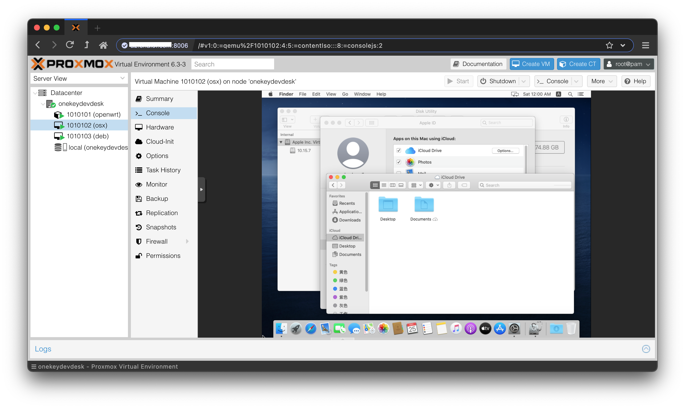

build and deploy your cloud hyper/desktop/disk with onekeystoke diskdumping(demo pics attached)
=====

onekeydevdesk is a multi-os bundle which implements a virtualboot+pve in the live rom core and an set of sub lxc/qemu containers and uilities/scripts based around the core，besides，onekeydevdesk is also a "vm-web" centric development stack.

> onekeydevdesk is also referred as：1keydd,1keydiskdump,1keydeepindsm,1keydebiandesk,1keydevdeploy,1keydebugdemo,1key desk dock,1key datacenter and desk,1key dir disk,etc ..

project repo url: https://github.com/minlearn/onekeydevdesk 

demo
-----

as the part of onekeydevdesk installation script, 1keydd inst.sh support dd progress show inside debian installer（ demo video：https://www.bilibili.com/video/BV1ug411N7tn/ ）  
1keydd ci.sh can extends to multiple target models including [az](p/ddexpandcicustom/az/),[oracle](p/ddexpandcicustom/orc/),[ksle](p/ddexpandcicustom/ks/),[spt](p/ddexpandcicustom/spt15g/) and customiablity, can be [self hosted](p/howtohost) and packaged into a repo,for each of your target host/target image combination,for later dd restoring  

as the part of onekeydevdesk os-bundle core,onekeydevdesk supports single integrated gpu switch freely between host/subos within a host,and "local experience of file sharing and syncing mechanism just as if they are hypermanager pervioned vms" arcoss mateable internet vps os and local vps os entries

as onekeydevdesk's linux container family sub OSes，onekeydevdesk lxc os can be installed on the cloud hosts and vps,all 3 lxc desktop containers(anbox,winebox,deepin) support hard-accelerated gpu video  

as one of onekeydevdesk's sub qemu vm OSes,dsm can be installed on vps, with no kvm-nested required upon host  

as one of onekeydevdesk's sub qemu vm OSes,osx uses standard full set kvm virtio drivers and bios model， should be installed on a 2c2g vps with kvm-nested (with 1c1.5g/2c2g give to osx, with 2c2g/3c3g give to osx the best),win11 is also supported,cloudosx+cloudwin11=local matedesk  

as part of onekeydevdesk uilities,1keydirdisk supports netdisk in dir-listing manner just inside file explorer

getting-started
-----

below are tested under vnc of an Debian and Debian flow Linux vps or local host,ubuntu <20.04,centos not recommended

> 安装onekeydevdesk,不喂任何参数默认等价于-s - -t onekeydevdesk  
> wget -qO- 1keydd.com/inst.sh | bash  

> 更多用法：  
> (安装其它目标os镜像：deb是纯净debian10,自定义镜像是你的raw系统硬盘格式经过gzip打包后托管的http/https地址)  
> wget -qO- 1keydd.com/inst.sh | bash -s - -t deb或自定gz镜像   

安装后，/run/initramfs/usr/bin/growpart /dev/vda(sda) 2,resize2fs /dev/vda(sda) 2扩展磁盘空间,root密码1keydd，https://xxx:8006为pve口，pve用户名root密码1keydd，vnc客户端连接你机器的ip:8059，密码为1keydd，二个lxc box的端口情况在各自的summary页有写，默认密码都是root/1keydd，如果是云主机建议开放8000-8100这些端口  

onekeydevdesk lxc os镜像在pve的storage->ct templates页可找到，github或github，不做说明的情况下，qemu版osx和dsm镜像并不提供开放托管和安装。  

docs
-----

更多请看项目文档库[《更多特点介绍和自助安装使用文档》](p/docs/)部分

donate
-----

btc:  3HFxtzyj36RZ35YvZmb5N4DiHAiCgreezm

usdt: TZ6YPtsojLCJEifNpwm38mmiq7T2gkhGKj

-----

此项目关联 https://github.com/minlearn/minlearnprogramming/tree/master/p/onekeydevdeskopen/ ，它是为配合我在《minlearnprogramming》最小编程/统一开发的想法的一个支持项目。  
本项目长期保存,联系作者协助定制onekeydevdesk os包括不限于机型适配，应用集成等。

