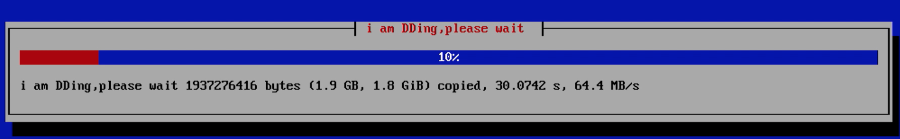
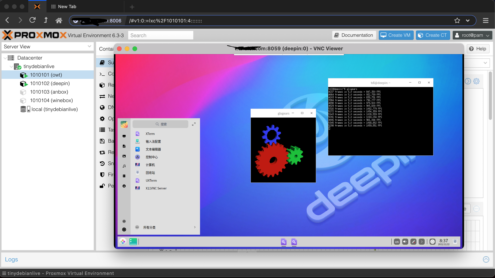
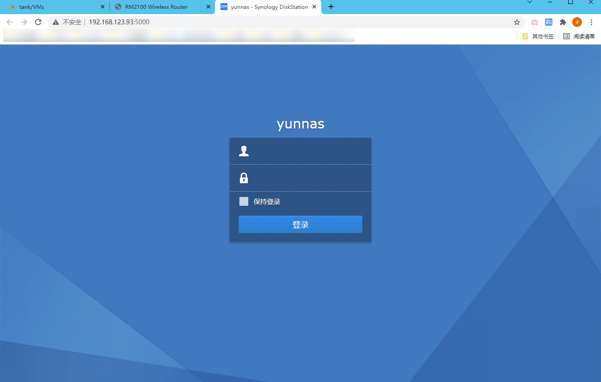
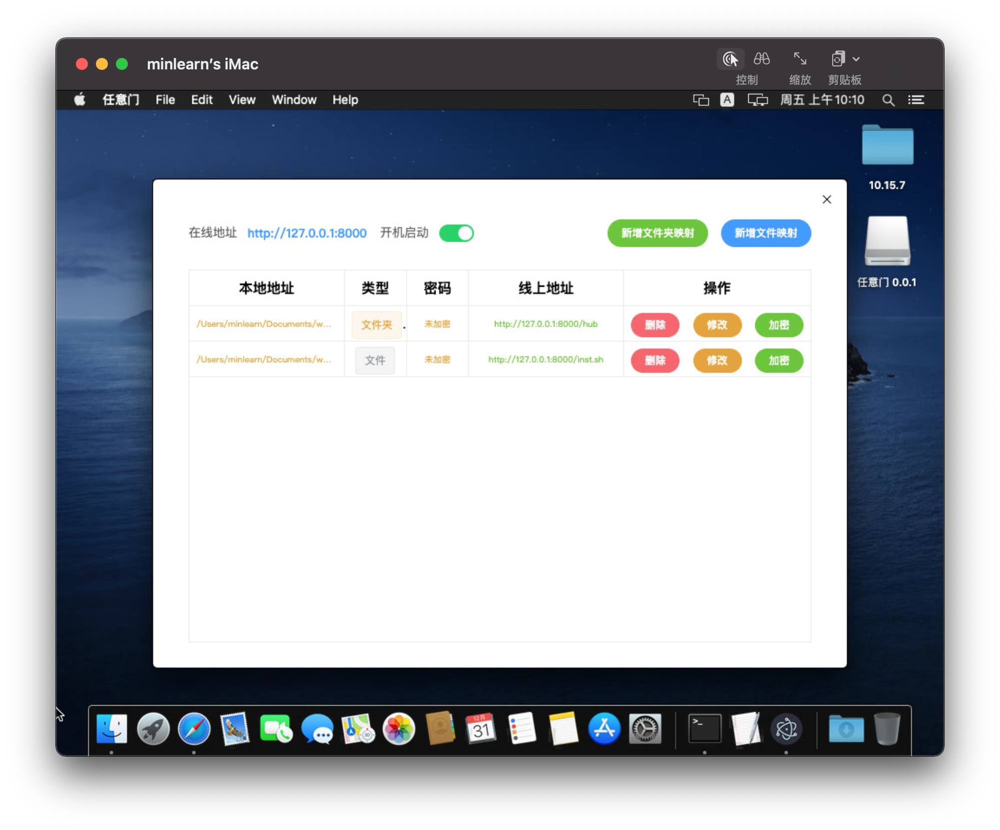

省事一键DD云虚拟机云pve云桌面云黑群晖云黑苹果云盘伴侣(带镜像有演示)
=====

onekeydevdesk是一套virtualboot+pve为liverom核心的系统，及一套基于lxc和qemu虚拟的多场景os及工具和脚本的打包，同时是云虚拟机系统和web为中心实现的开发栈  

> onekeydevdesk也指代：1keydd,1keydiskdump,1keydeepindsm,1keydebiandesk,1keydevdeploy,1keydebugdemo,1key desk dock,1key datacenter and desk,1key dir disk,etc ..

项目地址：https://github.com/minlearn/onekeydevdesk 

演示
-----

作为onekeydevdesk的安装脚本部分，1keydd inst.sh支持进度显示（ 视频演示：https://www.bilibili.com/video/BV1ug411N7tn/ ）  
1keydd ci.sh支持扩展多机型安装，包括[az](p/ddexpandcicustom/az/),[oracle](p/ddexpandcicustom/orc/),[ksle](p/ddexpandcicustom/ks/),[spt](p/ddexpandcicustom/spt15g/)，支持自打包，[自托管](p/howtohost)，可将你对应机型包括镜像在内的整个DD方案构建为一个可供DD安装的在线仓库 

作为onekeydevdesk的多OS部分核心，onekeydevdesk在本机内：支持单显卡核显输出在主从机间自由切换交还  
在本机外：支持本机和云主机同 os 组 mate （设置多个转发器，无缝局域网发现，共享与复制文件）类似本地多虚拟机体验  

作为onekeydevdesk的多子OS部分，三lxc系统anbox,winebox,deepin desktop支持显卡加速

作为onekeydevdesk的多子OS部分，dsm支持直接安装在云主机上，无须嵌套虚拟化

作为onekeydevdesk的多子OS部分，osx使用标准全套kvm驱动和bios机型配置，需要安装在支持嵌套虚拟化的2C2G以上云主机上（1c1.5g/2c2g给osx, 2c2g/3c3g给osx母鸡留1c1g最好），与本地组matedesk，win11类同。

作为onekeydevdesk的工具部分，1keydirdisk支持直接文件浏览器列目录方式做网盘直链

下载安装及用法
-----

以下尽量在debian系linux云主机vnc界面下或本地虚拟机下完成,ubuntu小于20.04,centos不推荐

> 安装onekeydevdesk,不喂任何参数默认等价于-s - -t onekeydevdesk  
> wget -qO- 1keydd.com/inst.sh | bash  

> 更多用法：  
> (安装其它目标os镜像：deb是纯净debian10,自定义镜像是你的raw系统硬盘格式经过gzip打包后托管的http/https地址)  
> wget -qO- 1keydd.com/inst.sh | bash -s - -t deb或自定gz镜像    

安装后，/run/initramfs/usr/bin/growpart /dev/vda(sda) 2,resize2fs /dev/vda(sda) 2扩展磁盘空间,root密码1keydd，https://xxx:8006为pve口，pve用户名root密码1keydd，vnc客户端连接你机器的ip:8059，密码为1keydd，二个lxc box的端口情况在各自的summary页有写，默认密码都是root/1keydd，如果是云主机建议开放8000-8100这些端口  

onekeydevdesk lxc os镜像在pve的storage->ct templates页可找到，gitee或github，不做说明的情况下，qemu版osx和dsm镜像并不提供开放托管和安装。 

文档
-----

更多请看项目文档库[《更多特点介绍和自助安装使用文档》](p/docs/)部分

服务
-----

免费
> 只提供inst.sh，可一站式解决你DD中大部分问题，去上面仓库，一键DD即可  
> 仅拥有inst.sh定制能力  

收费1
> 收费50，拥有ci.sh完整源码拥有定制能力，发全套onekeydevdesk ci.sh源码。省事一体解决你装机和集成应用的问题。  
> 可加作者个人TG：[minlearn_1keydd](https://t.me/minlearn_1keydd) 获取付款码  
> 个人TG只保持联系不提供无偿技术支持  

收费2
> 收费100，拥有收费1的所有服务。  
> 额外附加：享受源码升级1年，并可加一个永久TG互助组及作者个人TG  
> 可加作者个人TG：[minlearn_1keydd](https://t.me/minlearn_1keydd) 获取付款码加入  
>（加群获社区支持，楼主不定期会在TG互助组里面帮解决问题）  

收费3
> 收费100，osx或win11的永久镜像保存二选一，和安装服务一次。省事一体解决你部署mateos的需求  
> 可加作者个人TG：[minlearn_1keydd](https://t.me/minlearn_1keydd) 获取付款码  
> 个人TG只保持联系不提供无偿技术支持  

-----

此项目关联 https://github.com/minlearn/minlearnprogramming/tree/master/p/onekeydevdeskopen/ ，它是为配合我在《minlearnprogramming》最小编程/统一开发的想法的一个支持项目。  
本项目长期保存,联系作者协助定制onekeydevdesk os包括不限于机型适配，应用集成等。

